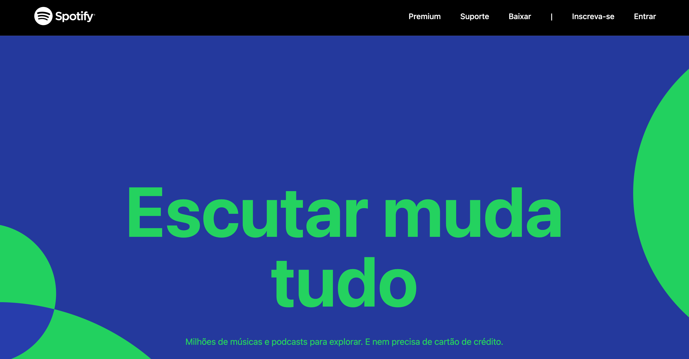

# Praticando o conhecimento em Tailwind

Esta é uma reconstrução da landing page do Spotify, com o objetivo de praticar o uso do Tailwind.

## Visão geral

### Captura de tela

### Links

- [Em produção URL:](https://spotify-tailwind.ercdev.com.br/)

## Meu proceso

### Construído com

- HTML5
- [Nuxt](https://nuxtjs.org/) - JS library
- [Vue.js](https://vuejs.org/) - Vue.js framework
- [Tailwind](https://tailwindcss.com/) - Utility-first CSS framework

## Autor

- [Me encontre](https://ercdev.com.br/)
